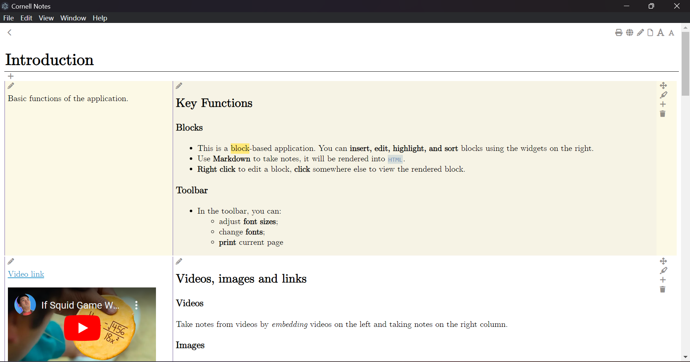

# Taking Cornell Notes in Markdown

This is a block-based application for taking Cornell Notes in Markdown.

There are two columns for cues and notes, as in Cornell Notes system.

- You can **insert**, **remove**, **highlight** and **sort** blocks using the widgets on the right. 
- The notes are stored in local `json` files.

## To-do list
- Linked blocks feature
- Enhance editing features
